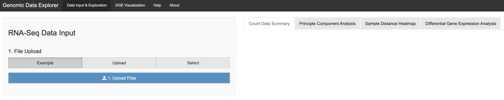

# GDE_RNA - R Shiny Visualization App for RNA-seq Data

This repository hosts the code for the RNA-seq visualization project at The University of Texas MD Anderson Cancer Center. 

It is only for demonstration purpose and not under active development. However, it may serve as a template for developing RNA-Seq-based visualization applications, and comments are always welcomed. Following are the instructions for using the app, and some notes for developers who may want to expand its functionalities.

---

### To Run the Application Locally Using Docker

It is recommended to use Docker to run the R Shiny application package `rocker_gde_rna:1.0`:

```
docker pull ghcr.io/xmc811/rocker_gde_rna:1.0
docker run --rm -p 3838:3838 ghcr.io/xmc811/rocker_gde_rna:1.0
```

You should be able to access the application at `localhost:3838`.

You may also clone the repository and run it within RStudio. However, it requires installation of additional R packages including [`xmcutil`](https://github.com/xmc811/xmcutil).

---

## User Interface

As shown in the figure below, there are four top navigation tabs. The first two tabs contain core functionalities of the app, while the last two are merely placeholders serving as templates for further development.

- Data Input & Exploration - includes data uploading, summary, sample-level data exploration, and differential gene expression (DGE) analysis.
- DGE Visualization - visualizes the DGE results, including MA plots, volcano plots, boxplots, sample-gene heatmaps, and Gene-Set Enrichment Analysis (GSEA).
- Help - a placeholder tab for embedding the `.pdf` help file.
- About - a placeholder tab for showing addtional information.



---

## File Upload

The file upload section contains three options. By default, the option "Example" is selected.

- Example - sample RNA-Seq data with 10 samples.
- Upload - users can upload HTSeq-count output files, with one file per sample.
- Select - a placeholder for further development.

